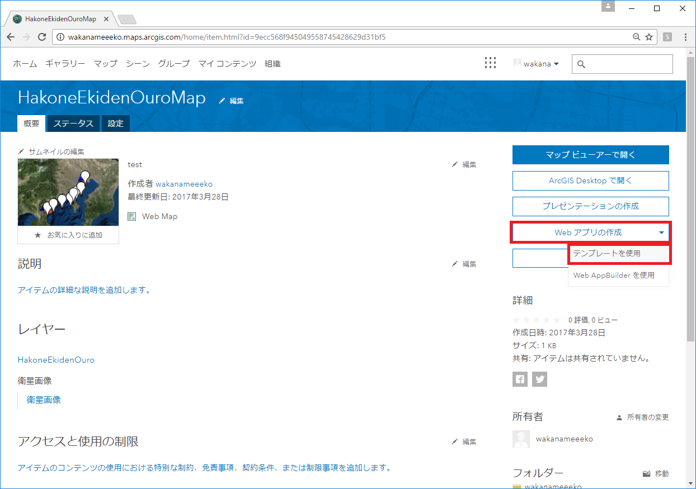
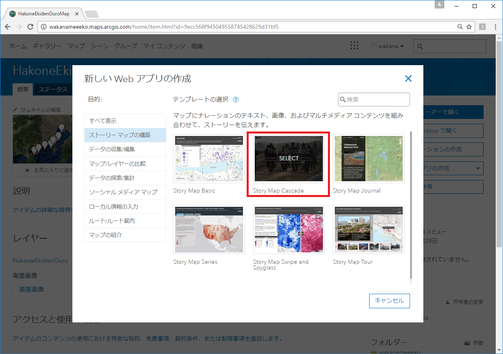
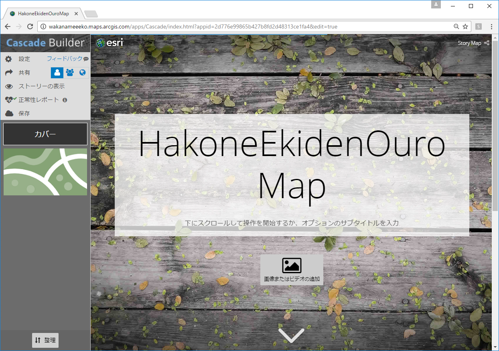
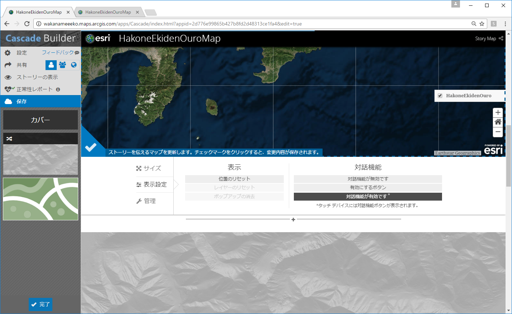
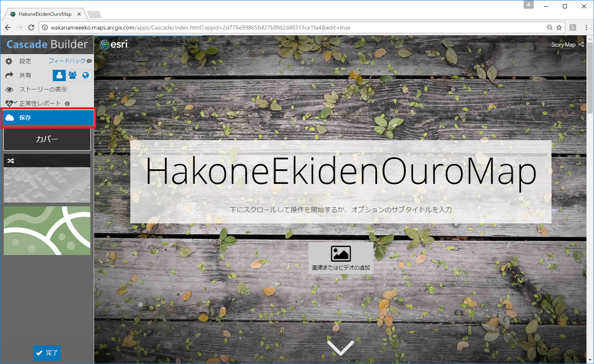

# ストーリーマップ カスケードを作成する

## ストーリーマップとは？
Web マップを使って、より分かりやすいマップアプリを作成できる機能です。
[ストーリーマップカスケード以外のストーリーマップ](https://www.esrij.com/cgi-bin/wp/wp-content/uploads/documents/StoryMap_Guide.pdf)を試してみたい方は、こちらをごらんください。

## ストーリーマップ カスケードとは？

スクロールして移動する没入型のストーリーを作成できます。
Story Map Cascade℠ (ストーリー マップ カスケード) アプリを利用すると、興味を引く全画面表示のスクロール操作によって、注釈テキストをマップ、画像、マルチメディア コンテンツと組み合わせることができます。カスケード ストーリーでは、テキストとインライン メディアを含むセクションの間に、マップ、3D シーン、画像、ビデオによって全画面表示される「没入型」セクションを織り交ぜることができます。カスケードは、操作が簡単で、説得力のある詳細なストーリーの作成に最適です。

## 手順

1. Webマップを作成する
1. ひな型のアプリ作成する
1. タイトルや画像などを編集する
1. 保存する
1. 作成したストーリーマップを共有する

## Webマップを作成する
[Web マップの作成方法](http://esrijapan.github.io/arcgis-dev-resources/create-webmap/)を参考に、作成します。

## ひな型のアプリ作成する
作成したWeb マップの詳細画面から[Webアプリの作成]→[テンプレートを使用]を選択します。

新しいWebアプリの作成から、[Stroy Map Cascade]を選択します。
その後、[Web アプリの作成]を選択、タイトルなど変更がなければ、デフォルトのままでOKを選択します。

テンプレートアプリが表示されます。

## タイトルや画像などを編集する
タイトルなどの文字はそのまま直感的に編集が可能です。
次のセクションを追加したい場合には、画面一番したの＋を選択して新たなセクションを追加します。
セクション間の順序は左ペインから変更可能です。

## 保存する
左ペインの[保存する]ボタンを選択して保存します。

## 作成したストーリーマップを共有する
左ペインの[共有]から、どのレベルに公開するか選択できます。

